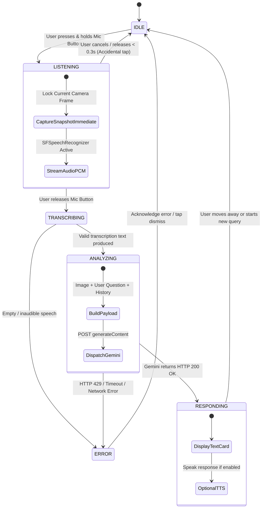

# T007 — Conversational Multimodal Interaction: Research & Architecture Design

> **Status:** `In Progress (Research & Design Phase)`  
> **Target Platform:** iOS 17.0+ (SwiftUI, AVFoundation, Speech, Vision, Gemini 2.5 Flash)  
> **Scope:** Architecture investigation, speech API trade-offs, conversational context models, and accessibility UX design. *(No source code implementation in this phase).*

---

## 1. Primary Research Question

> **"How can we allow a visually impaired user to naturally ask context-specific natural language questions about the physical visual scene in front of them, combining continuous camera input and speech input into a cohesive, low-latency, and trustworthy conversational accessibility assistant?"**

Rather than forcing the user to press an "Analyze" button for a generic, unsolicited one-size-fits-all description, this research establishes the foundation for an interactive dialogue:

* **User speaks:** *"What is this?"* $\to$ **AI responds:** *"That appears to be a rhizome of galangal based on its reddish-brown segmented skin."*
* **User follows up:** *"What is it commonly used for in cooking?"* $\to$ **AI responds:** *"It is widely used in Southeast Asian soups and curries like rendang and tom yum for its sharp, citrusy, pine-like flavor."*
* **User asks:** *"What is the printed expiration date on the box?"* $\to$ **AI responds:** *"The printed date in the lower right corner reads Best Before 12 November 2026."*

---

## 2. Current System Baseline (T002 – T006)

```text
[Camera Sensor 30fps]
         │
         ├─── On-Device Live Feed ───→ [VisionService] ───→ [RecognitionResult]
         │                                                        │
         │                                                        ↓
         │                                            [InterpretationService]
         │                                                        │
         │                                                        ↓
         │                                            [Continuous Local Result]
         │                                            (Banknotes, Labels, Categories)
         │
         └─── User Action (Tap Analyze) ───→ [Frame Capture: 1024px JPEG (~90KB)]
                                                        │
                                                        ↓
                                            [MultimodalService (REST API)]
                                            (Gemini 2.5 Flash + Fixed Prompt)
                                                        │
                                                        ↓
                                            [Plain-Text Headline & Explanation]
```

### Key Architectural Learnings from T006:
1. **Continuous On-Device Vision + OCR** (`VisionService`) provides instantaneous (~30ms), free, zero-network awareness of high-level categories and printed text.
2. **Automatic cloud triggering is unviable** because scene-stability dwell timers fire without explicit user intent, consume API quotas unnecessarily, and risk HTTP 429 rate limits.
3. **On-demand execution** puts the user in complete control.
4. **Decoupled Multimodal Engine:** `MultimodalService.analyzeImage(jpegData:prompt:apiKey:)` is already generalized and ready to accept custom user questions.

---

## 3. Apple Speech Recognition Technologies Evaluation

We evaluated Apple's native speech recognition APIs across capabilities, on-device availability, language support, and iOS target compatibility:

| Technology | iOS Availability | On-Device Processing | Real-Time Streaming | Latency Overhead | Indonesian Support | English Support | Implementation Complexity | Recommendation |
| :--- | :---: | :---: | :---: | :---: | :---: | :---: | :---: | :--- |
| **`SFSpeechRecognizer`** *(Speech.framework)* | iOS 10.0+ (Universal) | Yes (`requiresOnDeviceRecognition`) | Yes (Partial hypothesis callbacks) | ~80–180ms | Yes (`id-ID`) | Yes (`en-US`, `en-GB`) | Moderate (Well-documented `AVAudioEngine` pipeline) | **RECOMMENDED FOR FIRST PHASE** |
| **`SpeechAnalyzer` / `SpeechTranscriber`** *(New in iOS 18)* | iOS 18.0+ Only | Yes (Apple Neural Engine mandatory) | Yes (AsyncSequence streaming) | ~50–120ms | Limited on-device locale support | Yes (`en-US`) | Low (Modern Swift Concurrency) | *Future Migration (Restricts iOS 17 baseline)* |
| **Cloud Speech APIs** *(Google / Whisper REST)* | Universal | No (Uploads raw PCM audio) | Requires WebSockets | ~400–900ms | Yes | Yes | High (Separate cloud auth & network latency) | *Not Recommended (Redundant latency & privacy loss)* |

### Deep-Dive Analysis:
* **`SFSpeechRecognizer` (Recommended Baseline):**
  - **Verified Capability:** Works reliably on iOS 17.0+ deployment target. Supports Indonesian (`id-ID`) and English (`en-US`).
  - **On-Device Mode:** Setting `request.requiresOnDeviceRecognition = true` guarantees zero audio data ever leaves the iPhone, maximizing user privacy and eliminating cloud network latency for speech-to-text.
  - **Streaming:** Provides real-time partial transcription hypotheses as the user speaks, enabling immediate finalization the instant speech ceases.
* **`AVAudioSession` Coordination:**
  - Must configure `.playAndRecord` category with `.defaultToSpeaker` and `.allowBluetooth` options.
  - Must gracefully coordinate with VoiceOver: activating the microphone must not cause feedback loops with screen reader audio.

---

## 4. Voice Interaction Model Comparison

| Interaction Model | UX Flow | VoiceOver Harmony | Noise Tolerance | Cognitive Simplicity | Accidental Activation Risk | Latency & Turnaround | Recommendation |
| :--- | :--- | :--- | :--- | :--- | :--- | :--- | :--- |
| **Option A: Push-to-Talk (Hold-to-Speak)** | Press & Hold $\to$ Speak $\to$ Release to submit | Excellent (explicit physical boundary) | High (microphone active only while pressed) | Very high (tactile certainty) | Very Low | Instant submission on touch release | **RECOMMENDED FOR FIRST INCREMENT** |
| **Option B: Tap-to-Start / Tap-to-Stop** | Tap mic $\to$ Speak $\to$ Tap again to submit | Moderate (requires second precise tap) | Moderate (can stay open accidentally) | High | Low | Dependent on second tap speed | *Viable Alternative* |
| **Option C: Voice Activity Detection (VAD)** | Tap mic $\to$ Speak $\to$ Auto-stops after 1.0s silence | Low (silence threshold can cut off hesitant speech) | Low (ambient room noise delays cut-off) | Moderate | Moderate (false early stops) | +1.0s silence delay penalty | *Not Recommended for Phase 1* |
| **Option D: Continuous Conversational Mode** | Open mic listening continuously for wake phrases | Poor (competes with VoiceOver speech constantly) | Very Low (background babble triggers false queries) | Low (mental ambiguity over listening state) | Very High | Constant battery & compute drain | *Not Recommended* |

### Interaction Decision:
* **Push-to-Talk (Hold-to-Speak) is strongly recommended for the first conversational milestone.**
  - Visually impaired users receive absolute tactile confidence: holding the large button means "listening", releasing means "processing".
  - It eliminates the need for complex Voice Activity Detection silence thresholds that frequently cut off users mid-sentence when thinking.
  - It cleanly coexists with VoiceOver and eliminates accidental room chatter transcription.

---

## 5. Conversational Multimodal Context Strategy

When a user engages in dialogue, the system must coordinate physical visual snapshots with evolving conversation turns.

```text
Turn 1: "What is this?" ───→ [Capture Frame 1] ───→ Gemini ───→ "Galangal rhizome"
                                     │
Turn 2: "What is it used for?" ─────┼───→ [Reuse Frame 1 + History] ───→ Gemini ───→ "Cooking curries"
                                     │
Camera pans to new object (Divergence >= 0.50)
                                     │
Turn 3: "And what is this?" ─→ [Capture Frame 2 + History] ───→ Gemini ───→ "Indonesian Rp50,000 banknote"
```

### Strategic Rules:
1. **Frame Capture Timing for Initial Query:**
   * **Rule:** Snapshot the camera frame **at the exact moment the user presses Hold-to-Speak** (or immediately upon speech start).
   * **Rationale:** When a user points at an object and asks *"What is this?"*, their framing is most intentional at the start of the utterance. Capturing at the end of speech risks capturing motion blur if the user drops their hand while finishing their sentence.
2. **Follow-Up Query Handling (Image Reuse vs Refresh):**
   * **Rule:** If the user asks a follow-up question while the camera remains pointed at the **same object** (visual divergence $< 0.40$), **reuse the previous image snapshot** and append the new question to the multi-turn conversational context payload.
   * **Benefit:** Saves camera capture latency, eliminates JPEG compression overhead, and ensures Gemini reasons about the exact same physical image when clarifying details.
3. **Scene-Change Image Refresh:**
   * **Rule:** If the multi-signal divergence engine detects that the camera has moved to a new scene (divergence $\ge 0.50$), follow-up queries automatically capture **Frame 2**, providing the fresh visual target while retaining conversational awareness of prior turns.

---

## 6. Deterministic Conversation State Machine

To prevent the state-explosion issues experienced during automatic dwell testing, the conversational engine uses an explicit, non-overlapping 6-state machine:



### State Invariants:
1. **`IDLE`:** Camera viewfinder active; continuous on-device Vision/OCR scanning updates the screen. Zero cloud activity.
2. **`LISTENING`:** Mic active; frame snapshot captured synchronously at $t_0$; live partial speech hypothesis streamed.
3. **`TRANSCRIBING`:** Final speech transcription finalized on MainActor (<50ms).
4. **`ANALYZING`:** Downscaled 1024px JPEG + prompt dispatched to Gemini Flash. UI displays `"Analyzing question..."`.
5. **`RESPONDING`:** Plain-text answer presented on decision card; optional TTS audio playback.
6. **`ERROR`:** Transparent, accessible failure note displayed without raw HTTP codes.

---

## 7. Conversational AI System Prompt Design

The system prompt instructs Gemini 2.5 Flash to act as an accessibility visual dialogue partner:

```text
You are an intelligent, concise, and trustworthy visual accessibility assistant helping a person who is blind or has low vision.
The user is pointing their smartphone camera at an object and asking a spoken question.

CRITICAL GUIDELINES:
1. ANSWER THE SPECIFIC QUESTION: Focus directly on what the user asked. If they ask "What is this?", identify the object. If they ask "What is the price?" or "What does the text say?", focus on reading the relevant text.
2. BE CONCISE BY DEFAULT: Provide a direct 1 to 3 sentence response. Do not dump lengthy unsolicited descriptions unless the user explicitly asks for more detail (e.g. "Describe this thoroughly" or "Tell me more").
3. GROUNDED IN VISUAL EVIDENCE: Only state what is clearly visible in the provided image. Do not invent details, barcodes, dates, or markings that are obscured or illegible.
4. HONEST UNCERTAINTY: If visual evidence is insufficient, blurry, or ambiguous (e.g. distinguishing galangal from ginger, or a partially folded banknote), state the most likely answer and explicitly mention the ambiguity.
5. CLEAN PLAIN TEXT ONLY: Return clean natural-language prose. NEVER output Markdown formatting characters (no asterisks **, no bold markers, no hashtags #, no bullet points, no empty **** placeholders).
```

### Intent Handling Matrix:

| User Query Pattern | Model Intent | Example Output Strategy |
| :--- | :--- | :--- |
| **"What is this?"** | Primary Identification | Identifies object in 1 sentence with key sensory traits (color, texture, form). |
| **"What does it say?" / "Read this"** | OCR / Text Extraction | Transcribes visible text, dates, or instructions accurately without guessing obscured words. |
| **"How much money is this?"** | Currency Denomination | Confirms denomination (e.g. *"This is an Indonesian Rp50,000 banknote"*), notes if numeral is folded. |
| **"Tell me more" / "Describe it"** | Expanded Description | Details physical layout, dimensions, materials, and culinary/practical context. |
| **"Is this safe / expired?"** | Safety & Inspection | Reads printed dates or warning labels, adding explicit caution if packaging is unsealed or dates missing. |

---

## 8. On-Device Vision + OCR Fusion Strategy

Instead of treating on-device Vision/OCR and Gemini as isolated silos, the conversational engine fuses local sensor telemetry into the prompt payload:

```json
{
  "contents": [
    {
      "role": "user",
      "parts": [
        {
          "text": "CONTEXT FROM ON-DEVICE SENSORS:\n- Detected OCR Text: '50000, BANK INDONESIA, NEGARA KESATUAN REPUBLIK INDONESIA'\n- Broad Vision Category: 'currency'\n\nUSER QUESTION: How much money is this?"
        },
        {
          "inline_data": {
            "mime_type": "image/jpeg",
            "data": "<BASE64_1024PX_JPEG>"
          }
        }
      ]
    }
  ]
}
```

### Empirical Benefits:
* **Error Correction:** On-device OCR provides exact character readings of high-contrast text to prevent Gemini OCR hallucination.
* **Domain Focus:** Signals like `currency` or `plant` anchor the multimodal attention layer immediately, improving reasoning speed.

---

## 9. Text-to-Speech (TTS) & Audio Accessibility Investigation

### Native `AVSpeechSynthesizer` Capabilities:
* **Multi-Language Voice Selection:**
  - English: `AVSpeechSynthesisVoice(language: "en-US")` (Samantha, Alex, or Siri voices).
  - Indonesian: `AVSpeechSynthesisVoice(language: "id-ID")` (Damayanti or Indonesian Siri voice).
* **Interruption & Playback Control:**
  - `speechSynthesizer.stopSpeaking(at: .immediate)` enables instant cancellation whenever the user speaks or taps the screen.
* **VoiceOver Harmony:**
  - When VoiceOver is running (`UIAccessibility.isVoiceOverRunning`), the app must either:
    1. Rely on native `UIAccessibility.post(notification: .announcement, argument: responseText)`, allowing VoiceOver to read the answer in the user's preferred speech rate and voice.
    2. Duck secondary audio if custom `AVSpeechSynthesizer` is used.
  - **Recommendation:** Post accessibility announcements when VoiceOver is active; use `AVSpeechSynthesizer` when VoiceOver is disabled.

---

## 10. Privacy & Security Model

| Data Element | Destination | Privacy Safeguard |
| :--- | :--- | :--- |
| **Microphone Audio Stream** | **On-Device Only** | Transcribed locally via `SFSpeechRecognizer(requiresOnDeviceRecognition: true)`. Raw PCM audio is discarded from memory immediately upon transcription and is never transmitted over the network. |
| **Speech Text Transcription** | On-Device $\to$ Gemini Prompt | Sent over HTTPS directly to Google Generative Language API as plain-text prompt string. |
| **Camera Still Snapshot** | On-Device $\to$ Gemini API | Downscaled to 1024px JPEG (~90KB), transmitted over TLS 1.3 encrypted HTTPS. Stored in memory only during request lifetime; zero disk caching of captured frames. |
| **API Key Credentials** | **On-Device Private Keychain / UserDefaults** | Never tracked or committed in Git repository. Stored locally in device private sandbox. |

---

## 11. End-to-End Latency Budget

```text
[User finishes speaking & releases button] (t = 0ms)
        │
        ├── On-Device Speech Transcription Finalization:  ~40–80ms
        ├── Snapshot Downscaling (CoreImage to 1024px):    ~15–25ms
        ├── Base64 & HTTPS Payload Transmission:           ~120–200ms
        ├── Gemini 2.5 Flash Inference (Cloud):            ~450–750ms
        ├── JSON Response Deserialization:                 ~5ms
        └── MainActor SwiftUI Card Presentation:           ~10ms
                                                           ───────────
Total Perceived Response Latency:                          ~650ms – 1.1s
```

* **Target Experience:** The user releases the button, and within **~1 second**, the synthesized answer appears on screen and begins speaking aloud.

---

## 12. Evolving the Multimodal API Architecture

To transition cleanly from the current static `analyzeImage` function to conversational dialogue without breaking existing components, the service evolves into a multi-turn interface:

```swift
// Proposed Clean Service Protocol for T007 Development
protocol MultimodalReasoningService: Sendable {
    func askQuestion(
        image: Data,
        question: String,
        localContext: LocalEvidenceContext?,
        conversationHistory: [ConversationTurn]
    ) async -> MultimodalResult
}

struct LocalEvidenceContext: Sendable {
    let ocrText: String
    let visionCategory: String?
}

struct ConversationTurn: Sendable, Equatable {
    let role: ParticipantRole // .user or .assistant
    let text: String
    let timestamp: Date
}
```

---

## 13. Error Handling & Graceful Degradation

| Failure Scenario | Technical Detection | User-Facing Accessibility Response | Recovery Action |
| :--- | :--- | :--- | :--- |
| **Microphone Permission Denied** | `AVAudioSession.recordPermission == .denied` | Displays caution banner: *"Microphone access required for voice questions."* | Provides direct link to iOS Settings; "Analyze" tap remains functional. |
| **Inaudible / Empty Speech** | Transcription string empty upon release | Haptic error pulse; card displays *"Could not hear speech. Hold button and try speaking again."* | Resets state to `IDLE` immediately. |
| **API Rate Limit (HTTP 429)** | `httpResponse.statusCode == 429` | Displays local Vision interpretation + cautionary badge: *"AI is temporarily busy. Please try asking again shortly."* | Re-enables mic button; zero automatic retry storms. |
| **Cloud Network Unavailable** | URLSession timeout / offline | Displays continuous on-device Vision/OCR evidence: *"Network offline. Showing on-device recognition."* | Local pipeline remains 100% operational. |

---

## 14. Recommended Implementation Sequence (Milestones)

When T007 transitions from research into engineering, work should proceed in small, decoupled increments:

```text
Step 1: On-Device Speech Transcription Module (SpeechService)
        - SFSpeechRecognizer on-device pipeline
        - Hold-to-Talk microphone button component in CameraView
        - Verification: Spoken speech correctly renders as text on physical iPhone

Step 2: Multimodal Question Answering Integration
        - Wire captured speech string as custom prompt into MultimodalService
        - Verification: Asking "What is this?" vs "What does this say?" returns context-specific Gemini answers

Step 3: Multi-Turn Conversational Memory & Image Reuse
        - Implement ConversationTurn context buffer
        - Reuse initial snapshot for follow-up questions until camera pans away

Step 4: Spoken Output & Audio Haptics
        - AVSpeechSynthesizer / VoiceOver announcement integration
        - Haptic earcon feedback for listening start, stop, and answer ready
```

---

## 15. Summary of Architectural Decisions

1. **Voice Input Technology:** Native **`SFSpeechRecognizer`** with `requiresOnDeviceRecognition = true` for universal iOS 17+ support, Indonesian (`id-ID`) + English (`en-US`), zero audio data egress, and lowest latency.
2. **Interaction Trigger:** **Push-to-Talk (Hold-to-Speak)** as the primary interaction model for tactile certainty, high noise tolerance, and clean VoiceOver coexistence.
3. **Capture Timing:** Image frame snapshot captured synchronously at the **moment the user presses the button**.
4. **Context Strategy:** Follow-up questions reuse the initial snapshot until multi-signal scene divergence ($\ge 0.50$) confirms the user is pointing at a new object.
5. **Output Contract:** Concise, 1–3 sentence clean plain-text answers tailored to the user's specific intent.

---

## 16. T007.1 Implementation: Standalone On-Device Speech Input

### 1. Architectural Scope & Isolation
* **Zero Gemini Coupling:** The speech input pipeline is strictly standalone. Speech-to-text operates locally on the device and does **NOT** dispatch network requests to Gemini or alter the existing `Analyze` button.
* **On-Device Speech Recognizer:** Built using `SFSpeechRecognizer` with `requiresOnDeviceRecognition = true` on iOS 17.0+.
* **Audio Session Pipeline:** `AVAudioEngine` installs an audio tap on `inputNode` in `.playAndRecord` mode with `.defaultToSpeaker` and `.allowBluetooth`.
* **Privacy Permissions:** Configured `NSMicrophoneUsageDescription` and `NSSpeechRecognitionUsageDescription` in build configurations.
* **Language Support:** Implemented toggle supporting English (`en-US`) and Indonesian (`id-ID`).

### 2. Tactile Hold-to-Talk Interaction Flow
```text
User presses & holds [ 🎙️ Hold to Speak ]
            ↓
Haptic pulse (Medium) + UI enters Listening state (Red waveform)
            ↓
AVAudioEngine streams PCM buffer to on-device SFSpeechRecognizer
            ↓
Live partial transcription streams to floating Speech Card
            ↓
User releases button
            ↓
Haptic pulse (Light) + UI finalizes transcription (<250ms)
            ↓
Final question displayed cleanly in card (Zero cloud API requests)
```

---

## 17. T007.1 Physical Verification Matrix

| Test ID | Scenario | Input / Spoken Utterance | Expected Behavior | Physical Result |
| :--- | :--- | :--- | :--- | :--- |
| **TEST-01** | English Question | *"What is this?"* | Live partial transcript streams; final transcript reads *"What is this?"*; 0 Gemini calls. | `Pending Physical Test` |
| **TEST-02** | English Follow-Up | *"What is this used for?"* | Accurate transcription; UI displays question cleanly; 0 Gemini calls. | `Pending Physical Test` |
| **TEST-03** | Indonesian Question | *"Ini benda apa?"* (with `ID` locale toggled) | Accurate Indonesian transcription; 0 Gemini calls. | `Pending Physical Test` |
| **TEST-04** | Complex Long Sentence | *"Can you tell me what this object is used for and whether there is anything important I should know about it?"* | Full continuous sentence transcribed without premature truncation. | `Pending Physical Test` |
| **TEST-05** | Empty Speech | Press and release after 0.5s silence | Displays friendly note: *"I didn't hear a question."* | `Pending Physical Test` |
| **TEST-06** | Camera & Vision Concurrency | Hold mic while pointing at banknote | Vision/OCR classification and live preview continue running smoothly at 30fps without stutter. | `Pending Physical Test` |
| **TEST-07** | Gemini Isolation Verification | Speak multiple questions | Verified: Zero Gemini requests sent. `Analyze` button remains the sole manual cloud trigger. | `Pending Physical Test` |
| **TEST-08** | VoiceOver Compatibility | Screen reader focus on mic button | VoiceOver announces: *"Hold to ask a question. Press and hold while speaking, then release to finish."* | `Pending Physical Test` |

---

## 18. T007.2 Implementation: End-to-End Voice Queries (Speech → Image + Question → Gemini)

### 1. Architecture & Synchronization Pipeline
```text
t = 0: User presses & holds [ 🎙️ Hold to Speak ]
       │
       ├── Synchronously capture camera frame snapshot (1024px JPEG, ~90KB)
       ├── Lock reference scene (dominant classification + OCR text)
       ├── Haptic pulse (Medium) + VoiceOver announcement: "Listening"
       └── Start on-device SFSpeechRecognizer via AVAudioEngine

During speech:
       Live partial transcription streams to floating Speech Card

User releases button:
       │
       ├── Haptic pulse (Light) + finalize on-device speech transcription (<200ms)
       │
       ├── If speech is empty:
       │   └── Display: "I didn't hear a question." (Zero Gemini calls made)
       │
       └── If valid question (e.g. "What is this used for?"):
           ├── Display card status: "Analyzing question..."
           ├── VoiceOver announcement: "Analyzing your question"
           ├── Construct targeted Gemini prompt with user's specific question
           ├── POST generateContent to Gemini 2.5 Flash via native URLSession
           ├── Synthesize plain-text answer (HEADLINE: and DESCRIPTION:)
           ├── Update primary Interpretation Card with synthesized AI response
           ├── Retain spoken question in Speech Card: You asked: "What is this used for?"
           └── VoiceOver announcement: "[Headline]. [Description]"
```

### 2. Targeted Voice-Query System Prompt
```text
You are an intelligent visual accessibility assistant. Analyze the provided image to answer the user's specific spoken question.

USER'S QUESTION:
"<user's transcribed question>"

CRITICAL INSTRUCTIONS:
1. Answer the user's specific question directly based strictly on what is visible in the image.
2. Provide your response in two clearly labeled plain-text sections:
HEADLINE: [Concise 1 to 4 word summary or main answer, e.g. "Cooking Spice", "Rp50,000", "Price Unavailable"]
DESCRIPTION: [1 to 3 clear, plain-text sentences explaining the answer and visual justification]
3. If the question asks for information that cannot be determined from the image (such as hidden price, internal composition, or invisible dates), state clearly that it cannot be determined from the image alone without guessing.
4. Return plain text ONLY. Never output Markdown formatting (no asterisks **, no hashes #, no bullets, no empty **** placeholders).
```

---

## 19. T007.2 Physical Verification Matrix

| Test ID | Scenario | Target Object | Spoken Question | Expected Behavior | Physical Result |
| :--- | :--- | :--- | :--- | :--- | :--- |
| **TEST-01** | Primary Identification | Galangal | *"What is this?"* | Headline: *"Galangal"*; Description explains rhizome appearance and culinary context; 1 Gemini request. | `Pending Physical Test` |
| **TEST-02** | Functional Usage | Galangal | *"What is this used for?"* | Headline: *"Cooking Spice"*; Description explains usage in curries/soups without generic description dump. | `Pending Physical Test` |
| **TEST-03** | Currency Denomination | Rp50,000 Banknote | *"How much is this?"* | Headline: *"Rp50,000"*; Description identifies denomination from visible layout. | `Pending Physical Test` |
| **TEST-04** | Visual Attribute | Shaker Bottle | *"What color is this bottle?"* | Accurately identifies physical colors visible in frame. | `Pending Physical Test` |
| **TEST-05** | Unsupported Query | Random Object | *"How much does this cost?"* | Headline: *"Price Unavailable"*; Description states price cannot be determined from image alone. | `Pending Physical Test` |
| **TEST-06** | Camera Motion at Release | Object A $\to$ Object B | *"What is this?"* (pressed on Object A, moved to Object B) | Analyzes Object A because snapshot was captured at press ($t=0$). | `Pending Physical Test` |
| **TEST-07** | Empty Speech | None | Press & release immediately | Displays *"I didn't hear a question."*; 0 Gemini requests dispatched. | `Pending Physical Test` |
| **TEST-08** | Rate Limit Resilience | Any | Voice question on HTTP 429 | Clean local fallback note; zero retry loop; mic re-enabled cleanly. | `Pending Physical Test` |

---

## 20. Current Status

* **Status:** **In Progress (T007.2 End-to-End Voice Queries implemented and compiled; ready for physical iPhone testing).**
